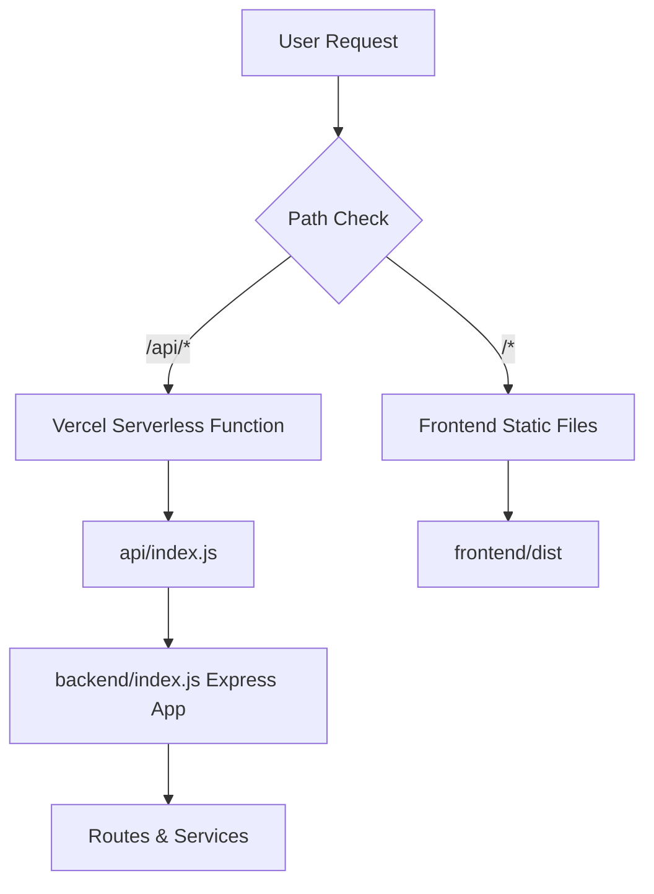

# 🏗️ Vercel Deployment Structure - Fixed

## ✅ **Issue Resolved**

The "backend/index.js doesn't match any Serverless Functions inside the api directory" error has been fixed by restructuring the project to follow Vercel's expected conventions.

## 📁 **New Project Structure**

```
order-management-system/
├── api/                    # Vercel serverless functions
│   ├── index.js           # Entry point for all API routes
│   └── package.json       # Module type configuration
├── backend/               # Express application code
│   ├── index.js          # Express app (now exports app)
│   ├── models/           # MongoDB models
│   ├── routes/           # API routes
│   └── services/         # Storage and business logic
├── frontend/             # React application
│   ├── src-jsx/         # Source code
│   └── dist/            # Build output
└── vercel.json          # Deployment configuration
```

## 🔧 **What Changed**

### **1. Created API Directory Structure**
- **`api/index.js`**: Vercel serverless function entry point
- **`api/package.json`**: Enables ES modules for the API

### **2. Modified Backend for Dual Mode**
- **Development**: Runs Express server locally
- **Production**: Exports app for Vercel serverless functions

### **3. Updated Vercel Configuration**
- **Functions**: Points to `api/index.js` (Vercel convention)
- **Rewrites**: Routes `/api/*` to the serverless function

## 📋 **How It Works**

### **Local Development**
```bash
npm run dev:backend  # Starts Express server on port 3000
npm run dev:frontend # Starts Vite dev server on port 8080
npm run dev          # Starts both concurrently
```

### **Vercel Production**
1. **Build**: Runs `npm run build` (builds frontend)
2. **Functions**: Creates serverless function from `api/index.js`
3. **Routing**: `/api/*` requests → serverless function
4. **Static**: All other requests → frontend static files

## 🚀 **Deployment Flow**



## ✅ **Benefits of New Structure**

1. **✅ Vercel Compatible**: Follows Vercel's serverless function conventions
2. **✅ Development Friendly**: Local development unchanged
3. **✅ Monorepo Support**: Maintains workspace structure
4. **✅ Performance**: Serverless functions scale automatically
5. **✅ Cost Effective**: Pay only for function execution time

## 🔍 **File Details**

### **`api/index.js`** (Serverless Function Entry)
```javascript
import app from '../backend/index.js';
export default app;
```

### **`backend/index.js`** (Modified Express App)
```javascript
// Export app for Vercel
export default app;

// Start server only in development
if (process.env.NODE_ENV !== 'production' || !process.env.VERCEL) {
  app.listen(PORT, () => {
    console.log(`Server running on port ${PORT}`);
  });
}
```

### **`vercel.json`** (Updated Configuration)
```json
{
  "buildCommand": "npm run build",
  "outputDirectory": "frontend/dist",
  "functions": {
    "api/index.js": {
      "maxDuration": 30
    }
  },
  "rewrites": [
    {
      "source": "/api/(.*)",
      "destination": "/api/index.js"
    }
  ]
}
```

## 🧪 **Testing the Setup**

### **Local Testing**
```bash
# Build and test
npm run build

# Start development
npm run dev

# Test API (if MongoDB configured)
curl http://localhost:3000/api
```

### **Production Testing** (After Deploy)
```bash
# Test API endpoints
curl https://your-app.vercel.app/api
curl https://your-app.vercel.app/api/orders/health
```

## 📊 **Environment Variables**

### **Required for Production**
- `MONGODB_URI` - MongoDB connection string
- `NODE_ENV=production` (auto-set by Vercel)

### **Optional Storage Variables** (after setup)
- `KV_REST_API_URL` - Vercel KV cache
- `KV_REST_API_TOKEN` - Vercel KV token
- `BLOB_READ_WRITE_TOKEN` - Vercel Blob storage

## 🎯 **Next Steps**

1. **Deploy**: Push to Git or run `vercel --prod`
2. **Set Environment Variables**: Add `MONGODB_URI` in Vercel dashboard
3. **Test**: Verify both frontend and API work
4. **Setup Storage**: Add KV and Blob storage for enhanced performance

---

**Your Order Management System is now properly structured for Vercel deployment!** 🚀
